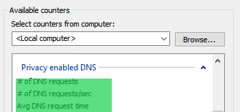

# peds

Protects your privacy by intercepting all DNS queries are forwards them to a 
[DNS over TLS](https://en.wikipedia.org/wiki/DNS_over_TLS) server. 
See the [DNS privacy problem](https://dnsprivacy.org/wiki/display/DP/DNS+Privacy+-+The+Problem) for background information.

## Features
- prevents man in the middle (MITM) attacks
- prevents the ISP from monitoring your activity
- prevents traffic analysis by using [EDNS padding](https://tools.ietf.org/html/rfc7830)

## Monitoring

### Counters

Performance counters are available to monitor the DNS requests to the PEDS server.

### Logging

TODO